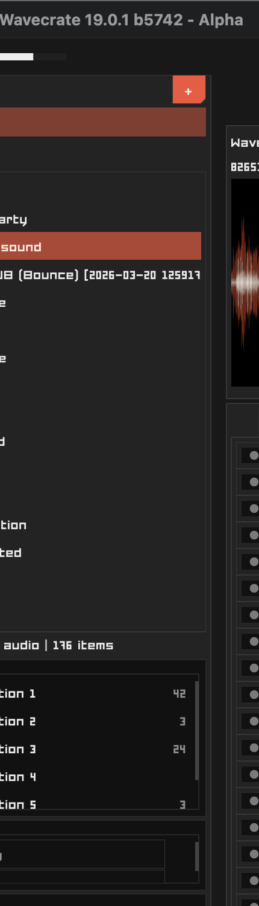
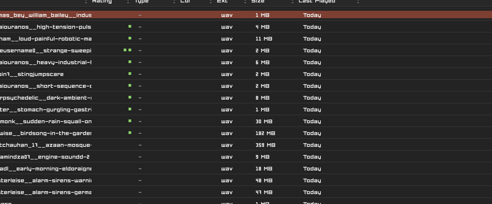
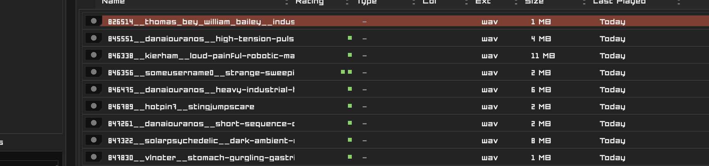
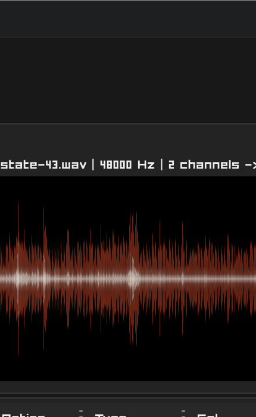

# Quick User Guide

This is the shortest path through Wavecrate: add a source, audition sounds, mark the useful part, extract or edit it, then keep enough metadata that you can find it again.

## 1. Add A Source

Start with a folder that contains WAV files. Click the plus button in Sources or drag the folder into the Sources panel.

Wavecrate indexes the folder and keeps the visible browser scoped to the source and folder selections on the left.

## 2. Audition The List

Select a row in the sample browser and press `Space` to play or pause. Use `Up` and `Down` to move through the visible list.

Useful first-pass moves:

- press `]` to mark a sound as Keep
- press `[` to mark a sound as Trash
- use folder, tag, rating, collection, and playback-age filters to narrow the list

## 3. Mark A Useful Region

Drag across the waveform with the primary mouse button to create a playmark selection. Use this when you want to loop, audition, copy, drag, or extract a region.

When you want an edit-specific target, create an editmark selection with the secondary mouse button. Editmarks are useful when the edit target should be separate from the play/audition target.

## 4. Loop, Extract, Or Copy

After marking a useful region:

- press `L` to loop the selected region
- press `E` to extract it as a new WAV
- press `Command-C` to copy the current waveform selection as an exported WAV clip
- drag the selection handle to a folder or DAW when drag-out is supported

## 5. Edit Deliberately

Use waveform edit commands when the selected audio should change:

- `C` crops to the selection
- `D` trims the selection out
- `R` reverses the selection
- `M` mutes the selection
- `N` normalizes the selection or sample, depending on focus

Destructive edits can rewrite files. Wavecrate prompts before destructive edits unless Yolo mode is enabled.

## 6. Keep The Result Findable

Rate, tag, rename, or place extracted clips into useful folders or collections. Wavecrate is strongest when quick auditioning and small metadata decisions happen in the same pass.

Use protected sources for original project material or long recordings that should stay safe while derived clips are created elsewhere.
