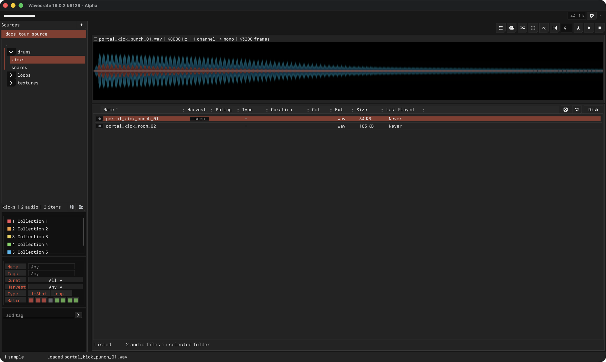
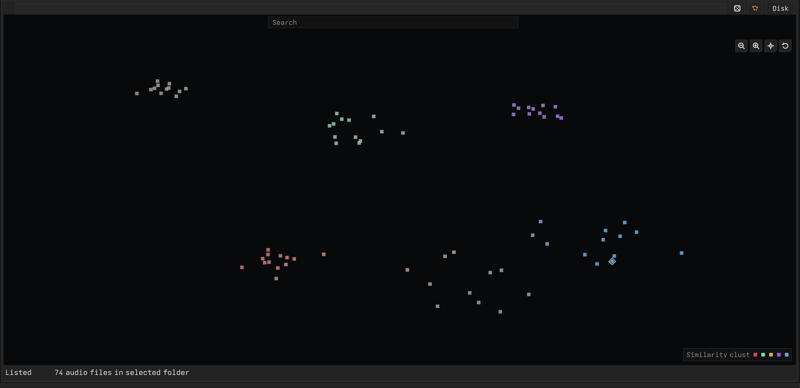

# Screenshots and Feature Tour

This page is the starter visual tour for new users. The focused screenshots below show the current Wavecrate app shell with a small sample source loaded.

## Main Window

The main window shows the core working loop:

1. Choose a source and folder scope.
2. Browse the visible sample rows.
3. Inspect the selected sample in the waveform.
4. Use filters, ratings, tags, and collections to narrow the library.
5. Extract or edit selected audio regions.

## Sources and Folders

Use the left side to add source roots, pick folders, adjust collection and filter controls, and keep browsing local to the material you care about right now.

The sidebar keeps the current library scope visible. A selected folder narrows the sample browser without changing the underlying files, while the lower controls let you refine the visible rows.

## Waveform and Region Editing

The waveform is where playback, looping, playmarks, editmarks, extraction, and destructive edits meet.

Use this area to seek, loop, create playmark selections, create editmark selections, and confirm whether an edit visually changed the selected audio.

## Sample Browser and Filters

The sample browser combines rows, ratings, collections, search, tags, and playback-age filters so you can work through a large library without losing context.

Rows stay tied to the current source and folder scope. Ratings, file type, size, last-played information, and disk paths help you make decisions without opening a file manager.

## Starmap

Starmap shows the current browser results as a spatial map, so similar samples can be scanned as clusters instead of only as rows.

Use it when you want to audition nearby sounds, compare groups of related samples, or move back to the list without losing the active source, folder, search, or filters.

## Metadata, Collections, and Tags

Collections, filters, and tags support fast triage without requiring a permanent folder move for every idea.

Use collections for temporary working buckets, tags for durable labels, filters for narrowing a pass, and ratings when you want a simple keep-or-reject pass.
